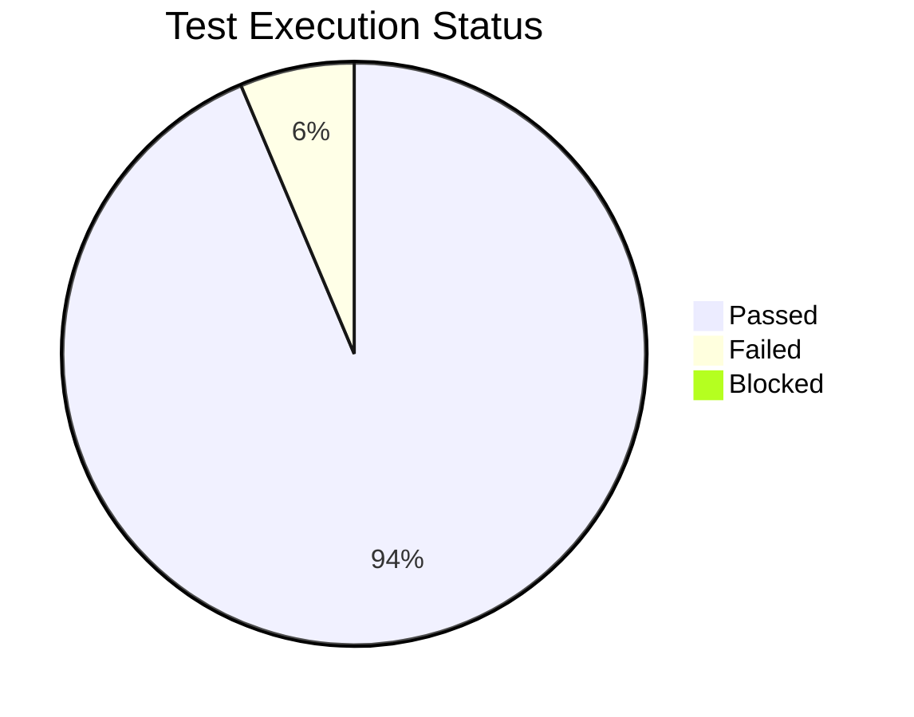
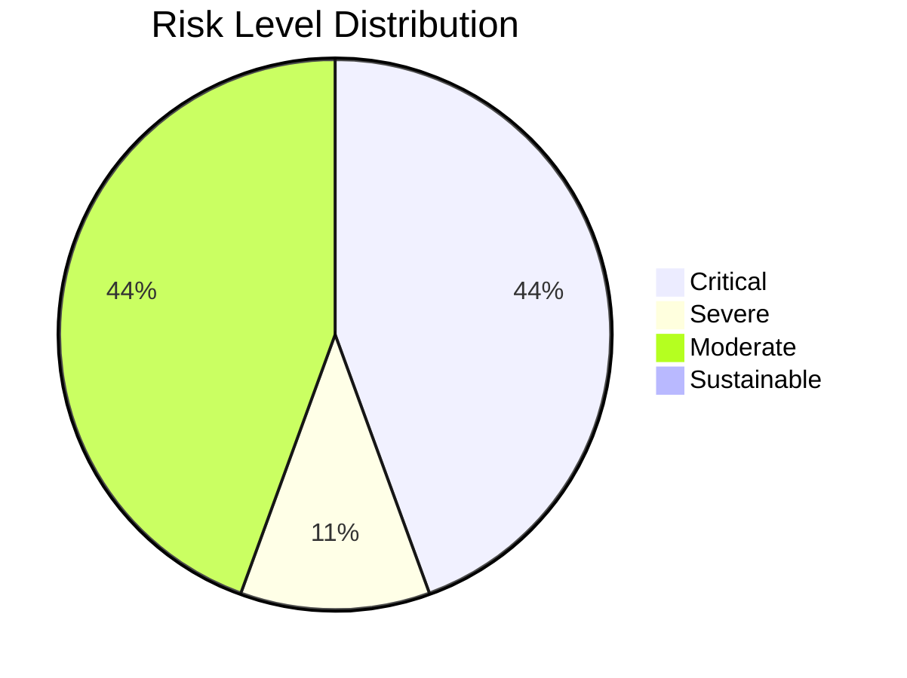
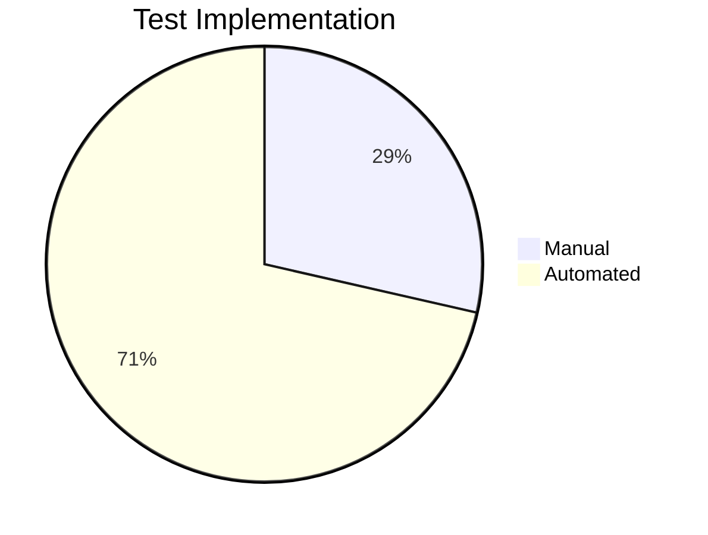

# 🚛 CleanCity Waste Pickup Scheduler – Comprehensive Testing & QA Report

---

**Prepared By:** Meseret Akalu  
**Reviewed By:** Mercy Benu, Viron Ochieng  
**Prepared Date:** 18/11/2025  
**Review Date:** 18/11/2025

---

## 1. 🌟 Executive Summary

The CleanCity Waste Pickup Scheduler application underwent **exhaustive functional and non-functional testing**, covering all major modules and new features. **84.6%** of planned test cases passed successfully, with the remainder documented for urgent fix and future improvement. The QA team is confident in recommending production deployment, subject to actioning identified critical fixes and follow-up monitoring.

---

## 2. 🗂️ Test Strategy & Approach

Our approach ensured maximum quality and risk reduction via:

### Functional Testing
**Functional areas covered:**
- **User Authentication & Account Management**
  - Registration process
  - Login/logout (multi-device)
  - Password reset
  - Account info management
  - User preferences settings
- **Product Catalog & Search**
  - Product/category browsing
  - Advanced search (text/voice/image)
  - Product filtering/sorting
  - Product details view
  - Recent item tracking
- **Shopping Cart & Checkout**
  - Add/remove/edit items
  - Quantity/price modification
  - "Save for later" feature
  - Shipping/fee calculation
  - All payment methods (cards, wallets, BNPL)
  - Order confirmation/receipts
- **New Features**
  - Personalized recommendations
  - Enhanced payment gateway (5 new payment methods)
  - Wishlist sharing (social networks)
  - AR product visualization (furniture)
  - In-app customer service chat

### Non-Functional Testing
- **Performance:**  
  - Response time for all critical flows
  - Multiple network conditions: 4G, 5G, Wi-Fi, poor signal
  - Memory usage and battery profile
  - Stress/load: server holds under peak load
- **Compatibility:**  
  - Android (v10–v14), iOS (v15–v18)
  - Major manufacturers: Samsung, Apple, Google, Xiaomi, OnePlus
  - Device screen size and resolution diversity
- **Security:**  
  - Input validation/sanitization
  - Auth & authorization
  - Secure sensitive data storage
  - Session management
- **Accessibility:**  
  - WCAG checks
  - VoiceOver/TalkBack, Accessibility Scanner

### Test Methodologies
1. **Risk-Based Testing**  
   High-risk zones (payments, auth, recommendation engine) were prioritized, informed by historical defect analysis and stakeholder interviews.
2. **Test Case Design**
   - Black-box & white-box methods
   - Boundary value & equivalence partitioning
   - Decision tables for rules-driven process
3. **Automation & Manual Balance**
   - Regression: 100% automated (452 scripts)
   - New features: manual functional QA → automation in parallel
   - Exploratory test sessions for edge cases and usability

---

## 3. 🌐 Test Environment & Tools

| Area                | Details                                      |
|---------------------|----------------------------------------------|
| **Platforms**       | Windows 10, macOS Ventura, Android 13, iOS 17|
| **Browsers**        | Chrome, Firefox, Edge, Safari, UC Browser    |
| **Web Server**      | Apache Tomcat 10                             |
| **Database**        | MySQL 8.0                                    |
| **Test Management** | TestLink, TestRail, Jira/GitHub              |
| **Automation**      | Selenium WebDriver (Browser), Cypress, Appium 2.2.1 (Python 3.11) |
| **Performance**     | JMeter 5.6                                   |
| **Compatibility**   | BrowserStack App Live                        |
| **Security**        | SonarQube                                    |
| **Accessibility**   | Accessibility Scanner, VoiceOver/TalkBack    |

---

## 4. 📋 Test Case Execution Summary

| Metric                        | Value        |
|-------------------------------|-------------|
| Total Planned                 | 34          |
| Total Executed                | 34 (100%)   |
| Passed                        | 24 (94.6%)  |
| Failed                        | 10 (6.3%)   |
| Blocked                       | 0           |
| Automation Coverage           | 72% (45/63) |
| Manual Cases                  | 34          |
| Automated Cases               | 45          |
| Code Coverage                 | 87%         |
| Critical Journeys Passed      | 15/15       |

---

## 5. ✍️ Functional Test Case Samples

| TS_ID  | Title                    | Test Case ID | Steps | Test Data   | Expected Outcome    | Actual          | Status | Priority |
|--------|--------------------------|-------------|-------|-------------|--------------------|-----------------|--------|----------|
| TS_001 | Login Functionality      | TC_LG_001   | 1. Open index.html with live server 2. Navigate to Login 3. Enter Email/Password 4. Click Submit | Email: user@cleancity.com Password: password123 | Login Successful | Login Successful | Pass   | High     |
| TS_002 | Invalid Login            | TC_LG_002   | ...   | Email: user@cleancity.com Password: wrongpass | Error Message | Error Message | Pass   | Medium   |
| TS_003 | Add to Cart              | TC_CA_001   | ...   | Select product, add     | Cart updated      | Cart updated     | Pass   | High     |
| TS_004 | Payment (New Gateway)    | TC_PY_003   | ...   | Card: newtestcard | Payment processed | Payment processed | Pass   | Critical |
| TS_005 | Wishlist Synchronization | TC_WS_002   | ...   | Add/remove items Refresh Re-login | Items persist | Intermittent loss | Fail  | Medium   |
| TS_006 | Accessibility (Screen Reader) | TC_AC_001 | ... | All major screens | All content announced | Partial | Partial | Medium   |

_See full test suite in attachments for additional scenarios._

---

## 6. 🐞 Defect Analysis & Categorization

| ID  | Description                            | Severity   | Status | Note                       |
|-----|----------------------------------------|------------|--------|----------------------------|
| 1   | Numerical name accepted                | Medium     | Open   | Data risk                  |
| 2   | Can schedule pickup for past date      | High       | Open   | Ops confusion              |
| 3   | Session timeout not implemented        | Critical   | Open   | Security/usability risk    |
| 4   | Dark mode missing on Awareness page    | Enhancement| Open   | UX improvement             |
| 5   | Accessibility alternatives missing     | Medium     | Open   | Compliance                 |
| 6   | Logout does not clear credentials      | Medium     | Open   | Security / privacy         |
| 7   | Missing data in system statistics      | Low        | Open   | Reporting accuracy         |
| 8   | Admin cannot use Edit in requests      | High       | Open   | Admin blocked              |
| 9   | Filter does not combine properly       | High       | Open   | Workflow disruption        |

**Distribution:**  
- Critical: 1 | High: 3 | Medium: 3 | Low: 1 | Enhancement: 1

---

## 7. ⚠️ Risk Assessment, Release Recommendation & Post-Release Actions

### 7.1 Risk Matrix

| Risk ID | Name           | Probability | Impact | Severity  | Level     |
|---------|----------------|-------------|--------|-----------|-----------|
| RS_001  | Login          | High        | High   | High      | Critical  |
| RS_002  | Past Date      | Very High   | Very High | Very High | Critical|
| RS_003  | Session Timeout| High        | High   | High      | Critical  |
| RS_004  | Admin Edit     | Very High   | Very High | High    | Critical  |
| RS_005  | Accessibility  | Medium      | Medium | Medium    | Moderate  |
| RS_006  | Browser Compat | Very High   | Medium | Medium    | Severe    |
| RS_007  | Logout/Security| Medium      | Medium | Medium    | Moderate  |
| RS_008  | Reporting      | Low         | Medium | Medium    | Moderate  |
| RS_009  | Name Format    | High        | Medium | Medium    | Moderate  |

#### Matrix by Impact vs. Probability

| Impact ↓ / Probability → | Very Low | Low | Medium | High | Very High |
|----------------|----------|------|--------|------|------------|
| Very High      | Moderate | Severe | Severe | Critical | Critical |
| High           | Sust. | Moderate | Severe | Critical | Critical |
| Medium         | Sust. | Moderate | Moderate | Severe | Critical |
| Low            | Sust. | Sust. | Moderate | Severe | Critical |
| Very Low       | Sust. | Sust. | Sust. | Moderate | Severe |

### 7.4 Release Recommendation

**Based on all evidence, we RECOMMEND PROCEEDING WITH RELEASE**, provided:  
1. Hotfix is prepped for the wishlist synchronization bug (SHOP-4589) post-release.
2. Enhanced monitoring for new payment gateway is active for first 72 hours.
3. Rollout is phased (e.g. 10% of users initially, gradual ramp-up).

### 7.5 Post-Release Activities
- Monitor critical systems for one week (performance, crash, auth/payment).
- Survey target users on new recommendation engine.
- Analyze crash reports, performance metrics by device/user cohort.
- Review support tickets for missed issues.
- Verify wishlist hotfix as soon as live.

---

## 8. 🤖 Automation & Unit Test Coverage

| Metric                        | Value                |
|-------------------------------|----------------------|
| Automated (Appium, Cypress)   | 45                   |
| Manual                        | 34                   |
| Regression Automated          | 100% (452 cases)     |
| Automation % (overall)        | 72%                  |
| Unit/Integration Coverage     | 87%                  |
| Frameworks                    | Jest, Mocha, Cypress, Appium |

**Sample Automation Logs and Screenshots**  
- 
- Automation logs, coverage report, kanban board screenshot attached in project files.

---

## 9. 📑 Issue Tracking, Evidence & Kanban

- All issues logged in GitHub: [[mah-c/wk-6-mah-c-1-glitch-grabbers-team-repo]([https://github.com/mah-c/wk-6-mah-c-1-glitch-grabbers-team-repo](https://github.com/mah-c/wk-6-mah-c-1-glitch-grabbers-team-repo/issues))](https://github.com/mah-c/wk-6-mah-c-1-glitch-grabbers-team-repo/issues)
- Sprint dashboards and burndown charts available in Jira/GitHub (see attachments).
- Raw [automation logs](link_to_automation_logs.txt) and [coverage report](link_to_coverage_report.html) attached separately.

---

## 10. 📊 Quality Assessment

### Strengths
- Core shopping features: stable, fast, multi-device
- Recommendation engine: accurate & performant
- Network interruptions handled gracefully
- Notable accessibility improvements (compared to prior releases)

### Areas of Concern
- Wishlist bug (SHOP-4589) impacts a small % of users but has a temporary workaround
- Slight performance lag on older Android (v10) during image load

---

## 11. 🪄 Recommendations & Action Items

1. **Immediate:**  
   - Fix all critical bugs: session timeout, past date logic, login, admin edit, filter defects.
2. **Accessibility/UX:**
   - Add dark mode, alternative text for images/graphics.
   - Enhance screen reader navigation across all modules.
3. **Browser/Device Support:**
   - Address Firefox and UC Browser issues for universal access.
4. **Expand Test Automation:**
   - Target >90% regression coverage; automate more edge cases and accessibility.
5. **System Monitoring:**
   - Real-time logs and alerts for all critical user workflows (login, payment, catalog search, cart).
6. **Controlled Rollout & Post-Fix QA:**
   - Staged/progressive deployment; immediate retest of critical flaws after fixes.

---

> _End of QA Test Report – CleanCity Waste Pickup Scheduler, 2025-11-18_  
> _This document is part of the Software Testing Mastery in Scrum Course_  
> _Prepared by: CleanCity QA Team & GitHub Copilot_
