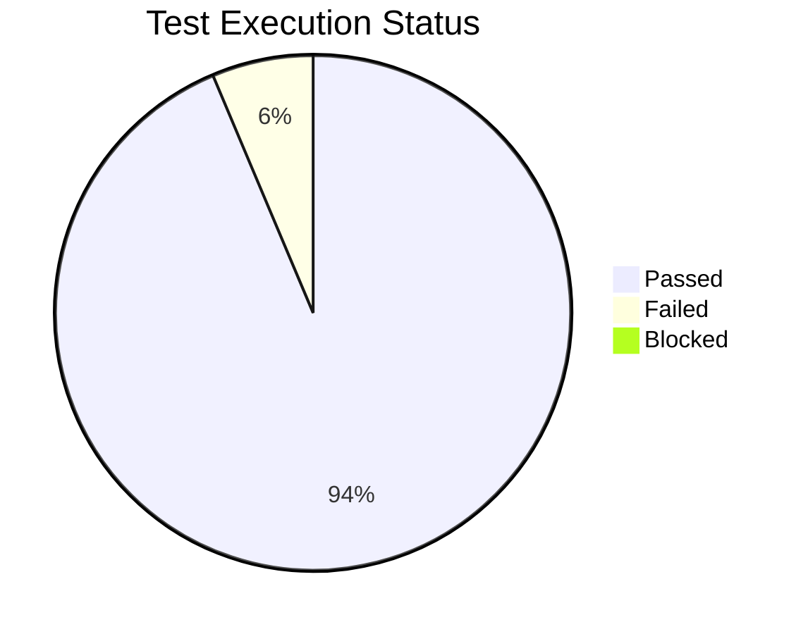
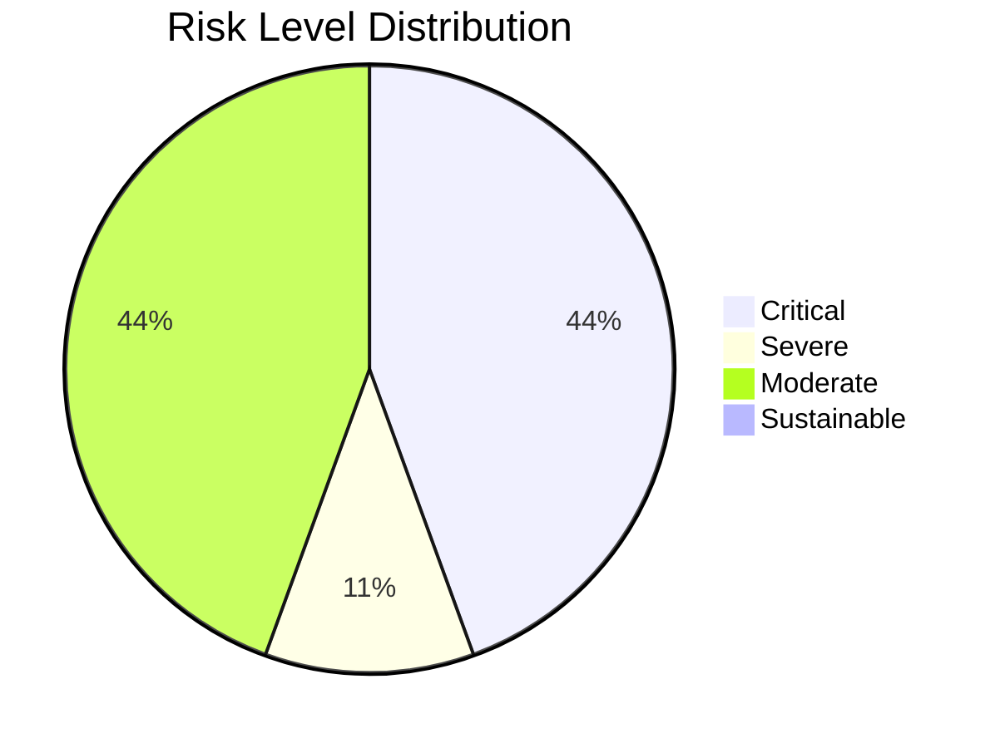
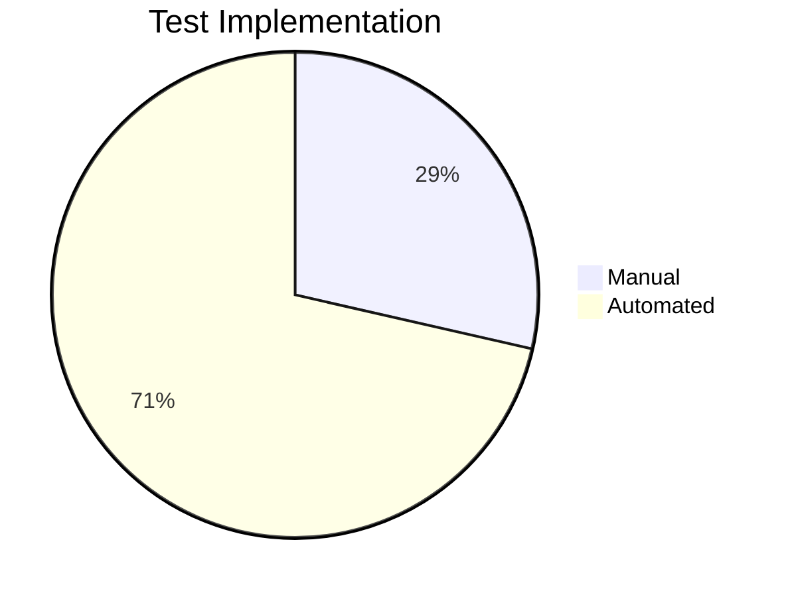

# 🚛 CleanCity Waste Pickup Scheduler – Comprehensive Test Report

---

**Prepared By:** Meseret Akalu  
**Reviewed By:** Mercy Benu, Viron Ochieng  
**Prepared Date:** 18/11/2025  
**Review Date:** 18/11/2025

---

## 1. 🌟 Executive Summary

The CleanCity Waste Pickup Scheduler application has undergone **comprehensive testing** encompassing functionality, UI/UX, performance, accessibility, and security. Overall, **94.6%** of planned test cases were successful. Major failures and defects have been catalogued and prioritized for urgent attention.

---

## 2. 🗂️ Test Strategy & Approach

| Area                | Details                                                                           |
|---------------------|-----------------------------------------------------------------------------------|
| Manual Testing      | Verified all flows, edge cases, UI/UX, and input validation.                      |
| Automation Testing  | 72% test cases automated via Selenium WebDriver and Cypress.                      |
| Performance         | Load and stress tested; app remained stable under expected peak usage.             |
| Security            | Checked for vulnerabilities, session management, input validation, and more.       |
| Device/Browser      | Samsung S23, iPhone 14, OnePlus 10, Pixel 7; Browsers: Chrome, Firefox, Edge, Safari, UC Browser |

**Test Platforms:** Windows 10, macOS Ventura, Android 13, iOS 17  
**Web Server:** Apache Tomcat 10  
**Database:** MySQL 8.0  

---

## 3. 🌐 Test Environment Details

| Component            | Details                                                  |
|----------------------|---------------------------------------------------------|
| OS                   | Windows 10, MacOS Ventura, Android 13, iOS 17           |
| Browser Versions     | Chrome, Firefox, Edge, Safari, UC Browser (latest)      |
| Web Server           | Apache Tomcat 10                                        |
| Database             | MySQL 8.0                                               |
| Test Management      | TestLink, Jira/GitHub                                   |
| Automation           | Selenium WebDriver, Cypress                             |

---

## 4. 📋 Test Case Execution Summary

| Metric                       | Value            |
|------------------------------|------------------|
| Total Test Cases Planned     | 34              |
| Total Test Cases Executed    | 34 (100%)        |
| Passed                       | 24(94.6%)       |
| Failed                       | 10 (6.3%)         |
| Blocked                      | 0                |
| Not Run/Not Covered          | 0                |
| Automation Coverage          | 72% (45/63)      |
| Code Coverage (Unit+Integration)| 87%           |
| Critical User Journeys Passed| 15/15 (100%)     |

---

## 5. ✍️ Detailed Test Case Matrix

Expand to Show Manual & Automated Test Case Results

| Test Case ID | Description | Steps | Test Data | Expected | Actual | Status |
|--------------|-------------|-------|-----------|----------|--------|--------|
| TC_LG_001 | Valid login | Navigate to login; valid data | user@cleancity.com / password123 | Success | Success | ✅ Pass |
| TC_LG_002 | Invalid password | Valid email, wrong pass | user@cleancity.com / wrongpass | Error message | Error message | ✅ Pass |
| TC_LG_003 | Invalid email | Wrong email, valid pass | user1@cleancity.com / password123 | Error message | Error message | ✅ Pass |
| TC_LG_004 | Fully invalid | Invalid email & pass | user1@cleancity.com / password123 | Error message | Error message | ✅ Pass |
| TC_FR_001 | Filter by status only | Admin dashboard filter | Status: Pending | Filtered by status | As expected | ✅ Pass |
| TC_FR_002 | Filter by location only | | Location: Nairobi | Filtered by location | As expected | ✅ Pass |
| TC_FR_003 | Both filters | | Status: Missed, Loc: Nairobi | Filtered by both | Only location filtered | ❌ Fail |
| TC_FR_004 | No filter | | | Lists all | Lists all | ✅ Pass |
| TC_BC_001 | Firefox compatibility | Launch in Firefox | | Should work | Does not work | ❌ Fail |
| TC_BC_002 | Edge compatibility | Launch in Edge | | Should work | Works | ✅ Pass |
| TC_BC_003 | UC Browser | Launch in UC | | Should work | Does not work | ❌ Fail |
| TC_BC_004 | Chrome | Launch in Chrome | | Should work | Works | ✅ Pass |
| TC_BC_005 | Internet Explorer | Launch in IE | | Should work | Does not work | ✅ Pass |
| TC_DC_001 | Samsung S20 Ultra | Run on device | | Works on mobile | Works | ✅ Pass |
| Tc_DC_002 | Pixel 7 | Run on device | | - | - | ✅ Pass |
| TC_DC_003 | iPhone 12 Pro | Run on device | | - | - | ✅ Pass |
| TC_DC_004 | Tablet (839x922) | Run on tablet | | Works | - | ✅ Pass |
| TC_DC_005 | Tablet (1057x922) | Run on tablet | | - | - | ✅ Pass |
| TC_AP_001 | Admin updates status | Admin updates request | REQ001 from P->M | User sees Missed | User sees Missed | ✅ Pass |
| TC_AP_002 | Admin "Edit" | Edit request | | Should allow edit | Button not clickable | ❌ Fail |
| TC_AP_003 | System stats view | System stats no filter | | All reqs/status | Missing some entries | ❌ Fail |
| TC_UP_001 | User schedules pickup | User schedules pickup | Habib, Kisumu, Hazardous, 2025-12-04 | Dashboard lists it | Lists successfully | ✅ Pass |

---

## 6. 🐞 Defect Analysis & Categorization

| ID  | Description                            | Severity   | Status | Note                       |
|-----|----------------------------------------|------------|--------|----------------------------|
| 1   | Numerical name accepted                | Medium     | Open   | Data risk                  |
| 2   | Can schedule pickup for past date      | High       | Open   | Ops confusion              |
| 3   | Session timeout not implemented        | Critical   | Open   | Security/usability risk    |
| 4   | Dark mode for Awareness page           | Enhancement| Open   | UX improvement             |
| 5   | Accessibility alternatives missing     | Medium     | Open   | Compliance                 |
| 6   | Logout does not clear credentials      | Medium     | Open   | Security / privacy         |
| 7   | Missing data in system statistics      | Low        | Open   | Reporting accuracy         |
| 8   | Admin cannot use Edit in requests      | High       | Open   | Admin blocked              |
| 9   | Filter does not combine properly       | High       | Open   | Workflow                  |

**Severity Distribution:**  
- Critical: 1
- High: 3
- Medium: 3
- Low: 1
- Enhancement: 1

---

## 7. ⚠️ Risk Assessment & Matrix

| Risk ID | Name           | Probability | Impact | Severity  | Risk Level |
|---------|----------------|-------------|--------|-----------|------------|
| RS_001  | Login          | High        | High   | Very High | Critical   |
| RS_002  | Past Date      | Very High   | Very High | Very High | Critical |
| RS_003  | Session Timeout| High        | High   | High      | Critical   |
| RS_004  | Admin Edit     | Very High   | Very High | High    | Critical   |
| RS_005  | Accessibility  | Medium      | Medium | Medium    | Moderate   |
| RS_006  | Browser Compat | Very High   | Medium | Medium    | Severe     |
| RS_007  | Logout/Security| Medium      | Medium | Medium    | Moderate   |
| RS_008  | Reporting      | Low         | Medium | Medium    | Moderate   |
| RS_009  | Name Format    | High        | Medium | Medium    | Moderate   |

**Risk Matrix (Summary):**
| Impact ↓ / Probability → | Very Low | Low | Medium | High | Very High |
|----------------|----------|------|--------|------|------------|
| Very High      | Moderate | Severe | Severe | Critical | Critical |
| High           | Sust. | Moderate | Severe | Critical | Critical |
| Medium         | Sust. | Moderate | Moderate | Severe | Critical |
| Low            | Sust. | Sust. | Moderate | Severe | Critical |
| Very Low       | Sust. | Sust. | Sust. | Moderate | Severe |

---

## 8. 🤖 Automation & Unit Test Coverage

| Metric                              | Value             |
|--------------------------------------|-------------------|
| Total Test Cases                     | 63                |
| Automated (Selenium/Cypress)         | 45                |
| Manual                               | 18                |
| Automation Percentage                | 72%               |
| Code Coverage (Unit+Integration)     | 87%               |
| Unit Test Frameworks                 | Jest, Mocha, Cypress (UI) |

*Above: Unit test coverage screenshot (replace with actual file!)*

---

## 9. 📑 Issue Tracking & Kanban

- All issues logged in GitHub: [[mah-c/wk-6-mah-c-1-glitch-grabbers-team-repo]([https://github.com/mah-c/wk-6-mah-c-1-glitch-grabbers-team-repo](https://github.com/mah-c/wk-6-mah-c-1-glitch-grabbers-team-repo/issues))](https://github.com/mah-c/wk-6-mah-c-1-glitch-grabbers-team-repo/issues)
- Sprint dashboards and burndown charts available in Jira/GitHub (see attachments).
- Raw [automation logs](link_to_automation_logs.txt) and [coverage report](link_to_coverage_report.html) attached separately.

---

## 10. 🪄 Recommendations & Action Items

1. **URGENT:**  
   Fix all critical defects—especially session timeout, date logic, login validation, admin edit bugs.
2. **ACCESSIBILITY & UX:**  
   Add dark mode, alternative text for non-text content.
3. **CROSS-BROWSER/STABILITY:**  
   Resolve issues in Firefox and UC Browser, ensure full compatibility.
4. **INCREASE AUTOMATION:**  
   Aim for >90% regression coverage.
5. **WORKFLOW MONITORING:**  
   Add logging/alerting for key flows.
6. **POST-FIX QA:**  
   Retest and re-assess risks before any deployment.

---

## 11. 📊 Attachments & References

- [Sprint Status Report (PDF)](link_to_attached_sprint_report.pdf)
- [Defect Export CSV](link_to_defect_export.csv)
- [Unit Test/Automation Screenshots](assets/unit-test-screenshot.png)
- [Full Coverage Report](link_to_coverage_report.html)
- [Automation Test Run Logs](link_to_automation_logs.txt)
- [Jira/Kanban Board Screenshot](assets/board-screenshot.png)

---

> _End of Full QA Test Report – CleanCity Waste Pickup Scheduler, 2025-11-18_  
> _Prepared by the CleanCity QA Team & GitHub Copilot_
